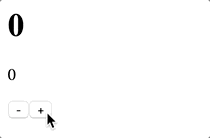

# Remold

You don't need to create a redux-like singleton to manage your application state. Use small objects instead!

## Install

```
npm install --save remold
```

## Getting started

Imagine that one of the parts of our application is the simple counter shown below:

```js
// Counter.js
export default class Counter {
  _count = 0

  increase() { this._count += 1 }

  decrease() { this._count -= 1 }
}
```

We want to present this counter using React component:
```js
// CounterComponent.jsx
import React from 'react'

const CounterComponent = ({ count, onClickPlus, onClickMinus }) => (
  <div>
    <p>{count}</p>
    <button onClick={onClickMinus}>-</button><button onClick={onClickPlus}>+</button>
  </div>
)

export default CounterComponent
```

And we also want to present the counter using Dashboard:
```js
// CounterDashboard.jsx
import React from 'react'

const CounterDashboard = ({ count }) => <h1>{count}</h1>

export default CounterDashboard
```

Remold can breathe a life to this React components. Edit `Counter.js`:
```js
// Counter.js
import { Remold, act, mold } from 'remold'
import CounterComponent from './CounterComponent'
import CounterDashboard from './CounterDashboard'

export default class Counter extends Remold {
  _count = 0

  @act increase() { this._count += 1 }

  @act decrease() { this._count -= 1 }

  @mold(CounterComponent) asComponent() {
    return {
        count: this._count,
        onClickPlus: this.increase,
        onClickMinus: this.decrease,
    }
  }

  @mold(CounterDashboard) asDashboard() {
    return {
      count: this._count,
    }
  }
}
```

Lets use our lively components:
```js
// App.js
import React from 'react';
import Counter from './Counter';

export default class App extends React.Component {
  render() {
    const counter = new Counter();
    return (
      <div>
       {counter.asDashboard()}
       {counter.asComponent()}
      </div>
    )
  }
}
```

Here is a result:



You can also play with example in [repl.it](https://repl.it/@Telichkin/RemoldCounter)
